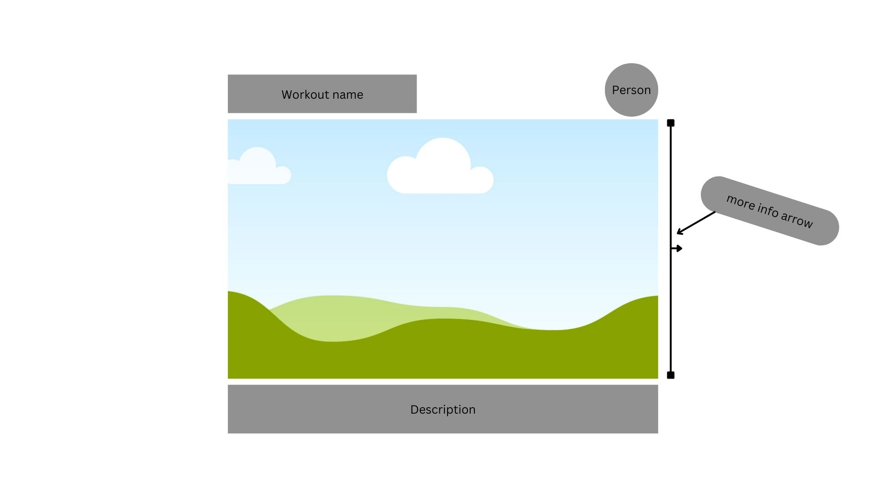

# workbook
## project description
Workbook is a library that where you can create workbooks accounts for different workouts and workout challenges, if ever you feel like working out you can select a challenge and after completing the challenge it will give you a challenge point every challenge will give you a challenge point.

# Wireframes

User can navigame thru the home page and see the list of challenges and select the ones the user likes or feel like to complete.

The user can click on the challenge and see the information about the challenge and/or the user that posted the challenge.
# MVP User Stories
As a user, I want to see and create workout challenges for me or the people whose interested in doing that workout.
As a user, I want to select the challenge that will complete or try to complete and be able to collect workout points to see my progress.
As a user, I want to be able to easily navigate the different challenges and see the detail and description of the challenge that I am interested in doing.

## Post MVP Stretch Goals
As a user, I would like to be able to search for workouts by name so that I can more easily find a workout and view its details.
As a user, I would like to filter the challenges by difficulty, so that I can more easily select the challenges based on the type of workout I'm interested in doing.